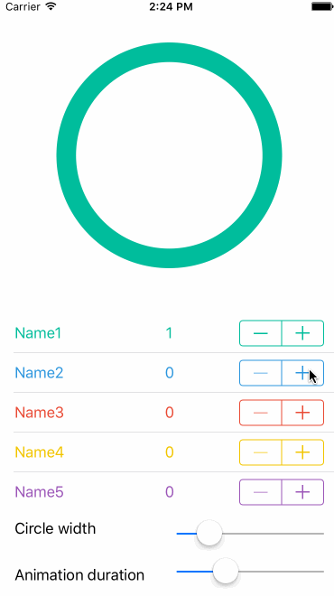

# LTCircleView
Animated circle diagram as seen in the BUNQ application

Preview
-------

	

------------

Instalation
---------
####CocoaPods

*Will soon be available on CocoaPods!*

####Manual Installation

Just drag and drop the `LTCircleView` folder into your project

Properties
----------

Name | Description
---- | ---------
**`animationDuration`**|`The animation time used to animate changes in the values (default value is 0.3)`
**`circleLineWidth`**|`Width of the line used to draw the circle (default value is 32.0)`

Features
---------
Normalizes the input values, and display the changes in a circle diagram.

DataSource
---------
LTCircleView provides you three datasource methods to provide the circle view with data:

    - (NSInteger)numberOfSegmentsInCircleView:(LTCircleView *)circleView;
    - (CGFloat)circleView:(LTCircleView *)circleView valueForSegment:(NSInteger)segment;
    - (UIColor *)circleView:(LTCircleView *)circleView colorForSegment:(NSInteger)index;

Updating the circle view can be done by calling the method:
    - (void)reloadData

License
-------
LTCircleView is available under the MIT license. See the [LICENSE](https://github.com/LcTwisk/LTCircleView/blob/master/LICENSE) file for more info.

Contributors
------------
[@LcTwisk](https://github.com/LcTwisk)

